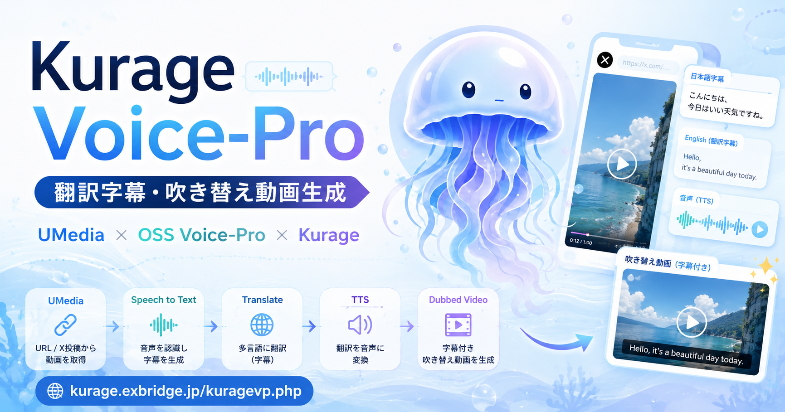

# Kurage Voice Pro

**Localize any video from a URL — transcribe, translate, add subtitles, and generate dubbed audio, automatically.**

Kurage Voice Pro (`kuragevp`) is a self-hosted, open-source video localization pipeline. Give it a video URL, and it downloads the video, extracts the audio, transcribes the speech, translates the subtitles, burns the translated subtitles into the video, synthesizes translated voice audio, and produces a dubbed video — ready to publish.

[](LICENSE)

## Demo

A video localized (Japanese subtitles + voice) with Kurage Voice Pro:
https://youtu.be/QqLiWGJRLEw



## Features

- **URL in, localized video out** — works with X (Twitter) videos and direct video URLs.
- **Speech-to-text** with Faster-Whisper (generates `.srt` subtitles).
- **Subtitle translation** via deep-translator.
- **Subtitle burn-in** with ffmpeg.
- **Text-to-speech dubbing** with Edge-TTS, swapped back into the original video.
- **Self-hosted** — FastAPI backend + PHP admin UI, runs on your own machine.
- **Pipeline-first** — a stable CLI/API path, no vendor lock-in.

## How it works

1. Download the video from a URL (FxTwitter + curl for X, direct curl for normal URLs).
2. Extract audio with ffmpeg.
3. Transcribe to subtitles (`.srt`) with Faster-Whisper.
4. Translate the subtitles.
5. Burn the translated subtitles into the video.
6. Synthesize translated voice audio (TTS) from the subtitles.
7. Replace the original audio with the translated voice to produce a dubbed video.

The resulting subtitled/dubbed video can be published as content on the [Kurage](https://github.com/katsushi2441/kurage) video platform.

## Tech stack

| Step | Tool |
|------|------|
| Transcription | Faster-Whisper |
| Translation | deep-translator |
| Text-to-speech | Edge-TTS |
| Media processing | ffmpeg (audio extraction, subtitle burn-in, audio replacement) |
| Backend / UI | FastAPI + PHP admin, shared login |

## Project layout

- `web/kuragevp.php` — admin UI (shared X login).
- `backend/main.py` — FastAPI: enqueue jobs, check progress, fetch video/subtitles/audio.
- `backend/pipeline.py` — the download-to-dubbed-video pipeline.
- `vendor/voice-pro/` — clone of [`abus-aikorea/voice-pro`](https://github.com/abus-aikorea/voice-pro) (heavy deps set up separately).

## Requirements

- Python 3.10+
- ffmpeg
- `faster-whisper`, `deep-translator`, `edge-tts` (see `backend/requirements.txt`)

## Quick start

```bash
git clone https://github.com/katsushi2441/kuragevp.git
cd kuragevp

# Optional: voice-pro vendor (for future voice-cloning TTS)
mkdir -p vendor
git clone https://github.com/abus-aikorea/voice-pro.git vendor/voice-pro

python3 -m venv .venv
. .venv/bin/activate
pip install -r backend/requirements.txt

uvicorn backend.main:app --host 0.0.0.0 --port 18302
```

The PHP admin (`web/`) is deployed to your public web root and uses a shared login. Finished subtitled/dubbed videos are saved with public metadata for the Kurage platform.

## Roadmap

- **Voice cloning** — integrate open-source voice generation (F5-TTS / CosyVoice / RVC via `voice-pro`) to match the dubbed audio to the original speaker's voice. Current releases use Edge-TTS to prioritize reliable end-to-end output.

## Related

- [Kurage](https://github.com/katsushi2441/kurage) — turns X posts into AI short videos. Kurage Voice Pro publishes its output as Kurage content.

## License

MIT © 2026 Katsushi Kojima — [Exbridge Inc.](https://exbridge.jp/)

---

## 概要（日本語）

Kurage Voice Pro は、**動画のURLを入れるだけで、文字起こし→翻訳→字幕焼き込み→吹き替え音声生成までを自動化**するセルフホスト型のオープンソース動画ローカライズ基盤です。

- 取得：X(Twitter)動画・通常の動画URLに対応
- 文字起こし：Faster-Whisper（SRT生成）
- 翻訳：deep-translator
- 字幕焼き込み／音声差し替え：ffmpeg
- 吹き替え音声：Edge-TTS（将来 F5-TTS / CosyVoice / RVC によるボイスクローンへ拡張予定）
- 管理画面：PHP、バックエンド：FastAPI（ポート18302）

生成した翻訳字幕・吹き替え動画は、AI動画基盤「Kurage」のコンテンツとして公開できます。名古屋・愛知でAI×OSSによる内製化支援を行う[株式会社エクスブリッジ](https://exbridge.jp/)が開発・公開しています。
